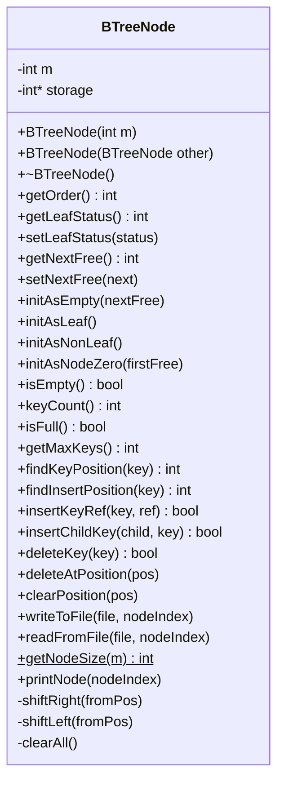

# IS321_Ass2_Fall2025 — B-Tree Index File Implementation


A group assignment for the **File Management & Processing (IS321)** course, Fall 2025. The goal is a disk-based B-Tree index stored inside a fixed-format binary file, implemented in C++: fixed-length nodes, insertion with splitting/propagation, deletion, key search, and a free-node linked list for reclaiming deleted node slots. The current codebase implements the core `BTreeNode` class that models a single on-disk node and its low-level operations.

## Features

- Fixed-size node layout: each node stores `2*m + 1` integers (a leaf flag, then interleaved key/reference or key/child-pointer pairs), enabling direct random-access reads/writes by node index
- Leaf vs. non-leaf node modes (`initAsLeaf` / `initAsNonLeaf`), plus a special "node zero" that tracks the head of a free-node linked list for reusing deleted slots
- Key lookup and insertion-position search within a node (`findKeyPosition`, `findInsertPosition`)
- In-node insert/delete of key-reference and key-child pairs, with internal shifting to keep entries contiguous
- Binary file I/O per node (`writeToFile` / `readFromFile`) sized via `getNodeSize(m)`
- Copy constructor and RAII-style cleanup for the node's dynamically allocated storage array

## Tech Stack

- C++ (raw pointers, `<fstream>` binary file I/O, no external dependencies)

## Project Structure

- `Node.h` — declares the `BTreeNode` class: accessors, initialization, capacity/status checks, insert/delete helpers, and file I/O
- `Node.cpp` — implements `BTreeNode`'s node-storage logic (constructors, key counting, position lookup, insertion/deletion within a node, etc.)
- `README.md` — assignment brief: course info, group member responsibilities, and the required top-level API (`CreateIndexFile`, `InsertNewRecordAtIndex`, `DeleteRecordFromIndex`, `DisplayIndexFileContent`, `SearchARecord`) that builds on top of `BTreeNode`

Note: as of this writing, the repository contains the `BTreeNode` building block; the top-level driver functions listed in the assignment brief are not yet present as separate source files.

## Architecture



## Installation

Requires a C++ compiler (e.g. g++) supporting C++11 or later.

```bash
g++ -std=c++11 -c Node.cpp -o Node.o
```

## Usage

`BTreeNode` is a building block meant to be driven by a main program that calls the assignment's required functions (`CreateIndexFile`, `InsertNewRecordAtIndex`, `SearchARecord`, `DeleteRecordFromIndex`, `DisplayIndexFileContent`). Example of using the node class directly:

```cpp
#include "Node.h"

BTreeNode node(5);        // order-5 B-tree node
node.initAsLeaf();
node.insertKeyRef(42, 100);
int pos = node.findKeyPosition(42);
```

## Demo

No live demo is available for this project.

---

**Author:** OmarElzero · [GitHub](https://github.com/OmarElzero)

_Last updated: 2026-08-23_
